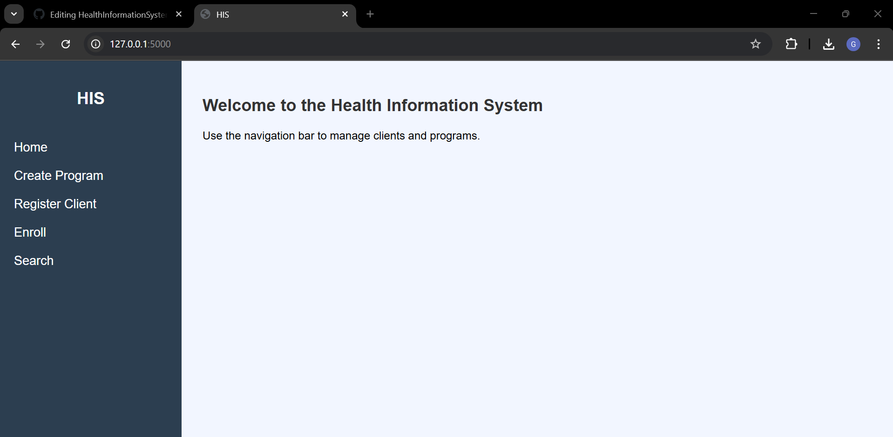
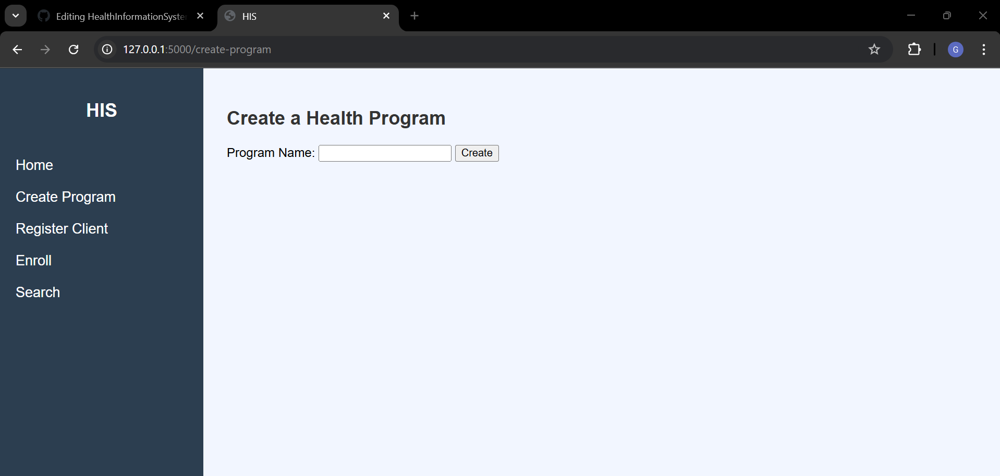
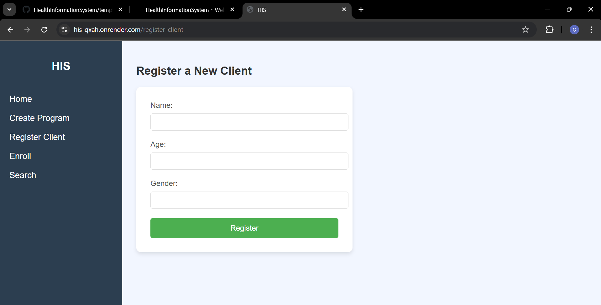
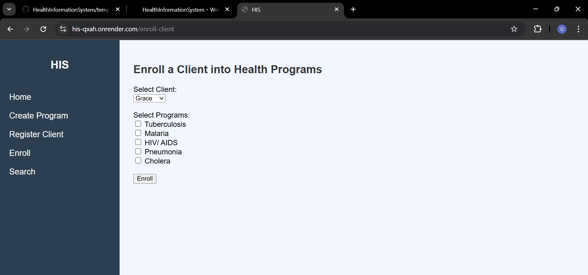
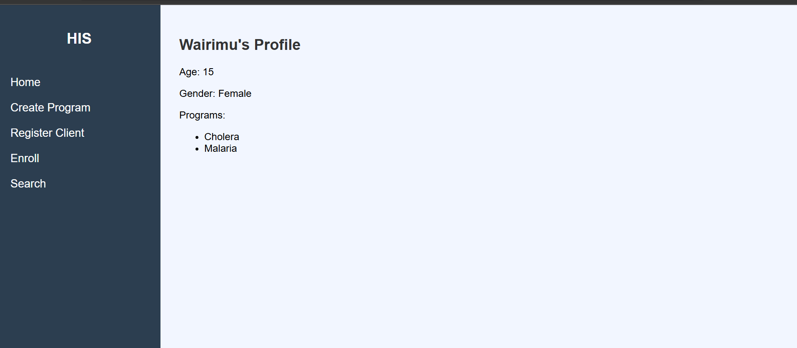
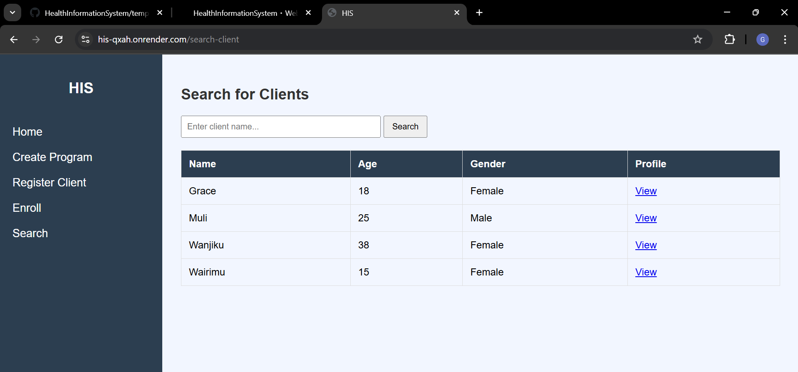

# 🏥 Health Information System

This project is a **basic Health Information System** built using **Flask**, **SQLite**, and **HTML/CSS**.  
It allows a doctor (user) to manage clients and health programs easily through a web interface.

## ✨ Features
- Create new health **programs** (e.g., TB, Malaria, HIV, etc.)
- **Register** new clients with name, age, and gender
- **Enroll** clients into multiple health programs
- **Search** for clients and view a full list
- **View** a client’s detailed profile and enrolled programs
- **Expose** client profiles via a **RESTful API** for external systems

## 📷 Screenshots

### Home Page


### Create Program


### Register Client Page


### Enroll Client Page


### Client Profile Page


### Search Clients Page



## 🚀 Technologies Used
- **Python 3**
- **Flask**
- **SQLite3** (Database)
- **HTML5**, **CSS3** (Frontend)
- **Flask-WTF** (for future form handling)

## 🛠️ Setup Instructions

1. Clone the repository:
   ```bash
   git clone https://github.com/GraceMuli/HealthInformationSystem.git
   cd HealthInformationSystem
   ```

2. Create and activate a virtual environment:
   ```bash
   python -m venv venv
   venv\Scripts\activate    # On Windows
   # or
   source venv/bin/activate # On Mac/Linux
   ```

3. Install dependencies:
   ```bash
   pip install -r requirements.txt
   ```

4. Run the application:
   ```bash
   python run.py
   ```

5. Open your browser and go to:
   ```
   http://127.0.0.1:5000/
   ```

## 📑 API Endpoints

- **Get a client's profile** (JSON):
  ```
  GET /api/client/<client_id>
  ```

  **Example Response**:
  ```json
  {
    "id": 1,
    "name": "Grace Muli",
    "age": 29,
    "gender": "Female",
    "programs": ["HIV Program", "Malaria Program"]
  }
  ```

## 🛡️ Security Notes
- Data validation and form handling ready (Flask-WTF ready for integration).
- API endpoint exposes **only necessary client data**.
- Project structure supports future authentication and user roles.

## 📈 Future Improvements
- Add **login system** for doctors
- Add **edit/delete client** functionalities
- Implement **pagination** for large client lists
- Host the project live (Render, Railway, Vercel)
- Enhance API with **token-based authentication**

## 👩‍💻 Author
- Grace Muli

## 📜 License
This project is licensed under the MIT License.
