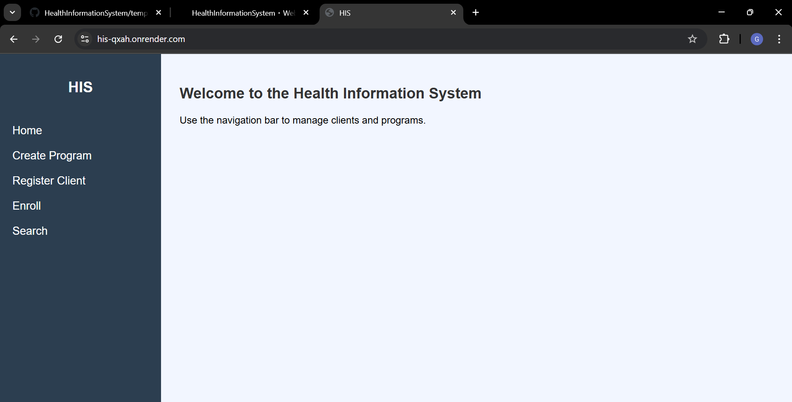

# 🏥 Health Information System

This project is a **basic Health Information System** built using **Flask**, **SQLite**, and **HTML/CSS**.  
It allows a doctor (user) to easily manage clients and health programs through a web interface.

## ✨ Features
- Create new health **programs** (e.g., TB, Malaria, HIV, etc.)
- **Register** new clients with name, age, and gender
- **Enroll** clients into multiple health programs
- **Search** for clients and view a full list
- **View** a client’s detailed profile and enrolled programs
- **Expose** client profiles via a **RESTful API** for external systems
- **Unit-tested**: 14 tests verifying functionality.

## 📷 Screenshots

### Home Page


### Create Program


### Register Client Page


### Enroll Client Page


### Client Profile Page


### Search Clients Page


## 🚀 Technologies Used
- **Python 3**
- **Flask**
- **SQLite3** (Database)
- **HTML5**, **CSS3** (Frontend)
- **Flask-WTF** (for form handling)
- Python **unittest** 

## 🛠️ Setup Instructions

1. Clone the repository:
   ```bash
   git clone https://github.com/GraceMuli/HealthInformationSystem.git
   cd HealthInformationSystem
   ```

2. Create and activate a virtual environment:
   ```bash
   python -m venv venv
   venv\Scripts\activate    # On Windows
   ```

3. Install dependencies:
   ```bash
   pip install -r requirements.txt
   ```

4. Set environment variables and run the flask app:
   ```bash
   set FLASK_APP=run.py
   set FLASK_ENV=development
   flask run
   ```
5. Access the application in your browser.

## 📑 API Endpoints

- **Get a client's profile** (JSON):
  ```
  GET /api/client/<client_id>
  ```

  **Example Response**:
  ```json
  {
    "id": 1,
    "name": "Grace",
    "age": 18,
    "gender": "Female",
    "programs": ["Malaria"]
  }
  ```

## ✅ Running Tests

This project uses Python's built-in unittest framework.

To run all tests:
```bash
python -m unittest discover -s tests
```
All the tests passed successfully:


## 🌐 Live Deployment

This application is live on Render.

-  [Health Information System](https://his-qxah.onrender.com/)


## 📄 Demo Presentation

Click here to view the powerpoint [presentation](Powerpoint_presentation.pdf)

## 👩‍💻 Author
- Grace Muli

## 📜 License
This project is licensed under the [MIT License](LICENSE).
